# 🏗️ Architecture — AI-Native Internal Developer Platform

> Multi-level architecture documentation following the [C4 Model](https://c4model.com/) approach.

---

## L0 — System Context Diagram

*Who interacts with the platform and what external systems does it depend on?*

```mermaid
graph TB
    Dev["👨‍💻 Developer"]
    SRE["👩‍💻 DevOps / SRE"]
    
    subgraph IDP["🟦 AI-Native IDP Platform"]
        Portal["🌐 Backstage Portal"]
        Agent["🤖 AI DevOps Agent"]
        Infra["🏗️ Infrastructure Layer"]
    end
    
    Gemini["🔮 Google Gemini API"]
    GitHub["🐙 GitHub"]
    AWS["☁️ AWS Cloud"]
    ArgoCD["🔄 ArgoCD"]
    
    Dev -->|"Browse Catalog\nScaffold Services\nSubmit Errors"| Portal
    SRE -->|"Diagnose Issues\nView Cluster Health\nCheck Runbooks"| Agent
    
    Portal -->|"HTTP REST"| Agent
    Agent -->|"LLM API Calls"| Gemini
    Agent -->|"K8s API"| AWS
    
    GitHub -->|"CI/CD Triggers"| IDP
    ArgoCD -->|"GitOps Sync"| AWS
    
    Portal -->|"Catalog Data"| AWS

    style IDP fill:#e3f2fd,stroke:#1565c0,stroke-width:2px
    style Gemini fill:#fce4ec,stroke:#c62828
    style GitHub fill:#f3e5f5,stroke:#6a1b9a
    style AWS fill:#fff3e0,stroke:#e65100
    style ArgoCD fill:#e8f5e9,stroke:#2e7d32
    style Portal fill:#bbdefb,stroke:#1565c0
    style Agent fill:#b39ddb,stroke:#4527a0
    style Infra fill:#90caf9,stroke:#1565c0
```

---

## L1 — Container Diagram

*What services, databases, and integrations make up the platform?*

```mermaid
graph TB
    subgraph UserFacing["🖥️ USER FACING"]
        Portal["🌐 Backstage Portal<br/><i>React + Node.js :7007</i>"]
        Chat["💬 ChatComponent<br/><i>AI Ops Plugin</i>"]
        Scaffolder["📋 Scaffolder Templates<br/><i>React SSR Template</i>"]
    end

    subgraph Backend["⚙️ BACKEND SERVICES"]
        Agent["🤖 AI DevOps Agent<br/><i>FastAPI / Python :8000</i>"]
        PG["🗄️ PostgreSQL<br/><i>v14 :5432</i>"]
        Chroma["🔶 ChromaDB<br/><i>Vector Store :8100</i>"]
    end

    subgraph Infra["☁️ AWS INFRASTRUCTURE"]
        EKS["☸️ AWS EKS<br/><i>Kubernetes 1.28</i>"]
        ECR["📦 Amazon ECR<br/><i>Container Registry</i>"]
        S3["🪣 Amazon S3<br/><i>State + Artifacts</i>"]
        RDS["🗄️ Amazon RDS<br/><i>Managed PostgreSQL</i>"]
    end

    subgraph External["🔌 EXTERNAL INTEGRATIONS"]
        Gemini["🔮 Google Gemini<br/><i>LLM API</i>"]
        GHA["🐙 GitHub Actions<br/><i>CI/CD Pipeline</i>"]
        Argo["🔄 ArgoCD<br/><i>GitOps Controller</i>"]
        OPA["🛡️ OPA Gatekeeper<br/><i>Policy Engine</i>"]
    end

    Chat --> Agent
    Portal --> PG
    Agent --> Gemini
    Agent --> Chroma
    Agent --> EKS
    GHA -->|"Docker Push"| ECR
    Argo -->|"Sync Manifests"| EKS
    OPA -->|"Validate"| EKS
    Portal --> Scaffolder

    style UserFacing fill:#e3f2fd,stroke:#1565c0
    style Backend fill:#f3e5f5,stroke:#6a1b9a
    style Infra fill:#fff3e0,stroke:#e65100
    style External fill:#e8f5e9,stroke:#2e7d32
```

---

## L2 — Component Diagram (AI DevOps Agent)

*What modules live inside the AI Agent and how do they interact?*

```mermaid
graph TB
    Request["📩 Incoming HTTP Request"]

    subgraph Agent["🤖 AI DevOps Agent (FastAPI :8000)"]

        subgraph Entry["🚪 ENTRY LAYER"]
            Router["FastAPI Router<br/><code>/diagnose</code><br/><code>/cluster-health</code><br/><code>/suggest-runbook</code><br/><code>/health</code>"]
            CORS["CORS Middleware<br/><i>Origin validation</i>"]
            Models["Pydantic Models<br/><i>Request/Response<br/>validation</i>"]
        end

        subgraph Processing["⚙️ PROCESSING LAYER"]
            LogAnalyzer["📊 Log Analyzer<br/><code>log_analyzer.py</code><br/>─────────────<br/>• Regex pattern matching<br/>• Error classification<br/>• Severity assignment"]
            K8sCollector["☸️ K8s Collector<br/><code>k8s_collector.py</code><br/>─────────────<br/>• Pod details & events<br/>• Deployment status<br/>• Node conditions<br/>• HPA & ResourceQuotas"]
            RAGChain["🧠 RAG Chain<br/><code>rag_chain.py</code><br/>─────────────<br/>• Runbook loading<br/>• Prompt construction<br/>• Gemini LLM call<br/>• JSON parsing"]
        end

        subgraph Data["💾 DATA LAYER"]
            Config["⚙️ Config<br/><code>config.py</code><br/><i>pydantic-settings</i>"]
            Runbooks["📚 Runbooks<br/>─────────────<br/>• crashloopbackoff.md<br/>• oomkilled.md<br/>• imagepullbackoff.md<br/>• terraform-state-lock.md"]
        end
    end

    K8sAPI["☸️ Kubernetes<br/>API Server"]
    GeminiAPI["🔮 Google<br/>Gemini API"]
    Response["📤 Structured JSON<br/>DiagnoseResponse"]

    Request --> Router
    Router --> CORS
    Router --> Models
    Router --> LogAnalyzer
    Router --> K8sCollector
    Router --> RAGChain
    
    LogAnalyzer -->|"Classifications"| RAGChain
    K8sCollector -->|"Cluster Data"| RAGChain
    RAGChain --> Runbooks
    RAGChain --> Config
    
    K8sCollector -->|"API Calls"| K8sAPI
    RAGChain -->|"LLM Call"| GeminiAPI
    RAGChain --> Response

    style Agent fill:#f3e5f5,stroke:#4527a0,stroke-width:2px
    style Entry fill:#e8eaf6,stroke:#283593
    style Processing fill:#ede7f6,stroke:#4527a0
    style Data fill:#f5f5f5,stroke:#616161
    style K8sAPI fill:#e3f2fd,stroke:#1565c0
    style GeminiAPI fill:#fce4ec,stroke:#c62828
```

---

## L3 — Infrastructure & Deployment Diagram

*How is everything deployed on AWS?*

```mermaid
graph TB
    subgraph AWS["☁️ AWS Cloud"]
        subgraph VPC["🔒 VPC (10.0.0.0/16)"]
            
            subgraph PublicSubnets["🌐 Public Subnets<br/>(10.0.101.0/24, 10.0.102.0/24)"]
                NAT["NAT Gateway"]
                ALB["Application Load Balancer<br/><i>Portal ALB</i>"]
                ALBSG["🛡️ SG: HTTP/HTTPS only"]
            end

            subgraph PrivateSubnets["🔐 Private Subnets<br/>(10.0.1.0/24, 10.0.2.0/24)"]
                
                subgraph EKS["☸️ EKS Cluster (K8s 1.28)"]
                    subgraph NSPlatform["📦 Namespace: idp-platform"]
                        AgentDeploy["🤖 AI Agent<br/>Deployment<br/><i>2 replicas, non-root</i><br/><i>256Mi/512Mi memory</i>"]
                        PortalDeploy["🌐 Portal<br/>Deployment"]
                        SA["🔑 ServiceAccount<br/><i>IRSA annotated</i>"]
                        NP["🛡️ NetworkPolicy<br/><i>Ingress: portal only</i><br/><i>Egress: DNS + HTTPS</i>"]
                    end
                    
                    subgraph NSArgo["📦 Namespace: argocd"]
                        ArgoServer["🔄 ArgoCD Server<br/><i>Auto-sync + self-heal</i>"]
                    end
                    
                    subgraph NSGatekeeper["📦 Namespace: gatekeeper-system"]
                        OPAGatekeeper["🛡️ OPA Gatekeeper<br/><i>LoadBalancer tag policy</i>"]
                    end

                    WorkerSG["🛡️ SG: EKS Workers"]
                end

                subgraph RDSBlock["🗄️ RDS"]
                    RDS["PostgreSQL 14<br/><i>db.t3.small</i><br/><i>20GB gp3</i>"]
                    RDSSG["🛡️ SG: Port 5432<br/><i>from EKS workers only</i>"]
                end
            end
        end

        S3State["🪣 S3 Bucket<br/><i>Terraform State</i><br/><i>Encrypted, Versioned</i>"]
        DDB["📋 DynamoDB<br/><i>State Locking</i>"]
        ECR["📦 ECR<br/><i>Container Images</i>"]
        IAM["🔑 IAM<br/><i>IRSA Roles</i>"]
    end

    ALB --> PortalDeploy
    SA -.->|"Assumes Role"| IAM
    ArgoServer -->|"Deploys"| NSPlatform

    style AWS fill:#fff3e0,stroke:#e65100,stroke-width:2px
    style VPC fill:#e3f2fd,stroke:#1565c0,stroke-width:2px
    style PublicSubnets fill:#e8f5e9,stroke:#2e7d32
    style PrivateSubnets fill:#fce4ec,stroke:#c62828
    style EKS fill:#e8eaf6,stroke:#283593
    style NSPlatform fill:#f3e5f5,stroke:#6a1b9a
    style NSArgo fill:#e8f5e9,stroke:#2e7d32
    style NSGatekeeper fill:#fff9c4,stroke:#f57f17
    style RDSBlock fill:#e3f2fd,stroke:#1565c0
```

---

## L4 — CI/CD & GitOps Pipeline

*How does code flow from commit to production?*

```mermaid
graph LR
    Dev["👨‍💻 Developer"] -->|"git push"| GH["🐙 GitHub<br/>Repository"]

    subgraph CICD["🔄 GitHub Actions CI/CD"]
        direction TB
        Lint["🔍 Lint & Test<br/><i>Ruff + pytest</i><br/><i>Python 3.11</i>"]
        Build["🐳 Build & Push<br/><i>Docker → ECR</i><br/><i>main branch only</i>"]
        TF["🏗️ Terraform<br/>Validate<br/><i>fmt + validate</i>"]
        K8sVal["☸️ K8s Validate<br/><i>kubeval strict</i>"]
        Sec["🔒 Security Scan<br/><i>Trivy CVE</i><br/><i>CRITICAL + HIGH</i>"]
    end

    GH -->|"Trigger"| Lint
    GH -->|"Trigger"| TF
    GH -->|"Trigger"| K8sVal
    Lint -->|"Pass"| Build
    Build -->|"Pass"| Sec

    Build -->|"Push Image"| ECR["📦 Amazon ECR"]

    subgraph GitOps["🔄 GitOps (ArgoCD)"]
        Argo["ArgoCD<br/><i>Watches gitops/ dir</i>"]
        Sync["Auto-Sync<br/><i>Self-heal</i><br/><i>Prune enabled</i><br/><i>Retry backoff</i>"]
    end

    GH -->|"gitops/ changes"| Argo
    Argo --> Sync

    subgraph Deploy["☸️ EKS Cluster"]
        OPA["🛡️ OPA Gatekeeper<br/><i>Policy validation</i>"]
        Manifests["📦 Applied Manifests<br/><i>Deployment</i><br/><i>Service</i><br/><i>NetworkPolicy</i>"]
    end

    Sync -->|"Apply"| OPA
    OPA -->|"✅ Compliant"| Manifests
    OPA -.->|"❌ Blocked"| Reject["🚫 Non-compliant<br/>resource rejected"]
    ECR -->|"Pull Image"| Manifests

    style CICD fill:#f3e5f5,stroke:#6a1b9a,stroke-width:2px
    style GitOps fill:#e8f5e9,stroke:#2e7d32,stroke-width:2px
    style Deploy fill:#e3f2fd,stroke:#1565c0,stroke-width:2px
    style Reject fill:#ffcdd2,stroke:#c62828
```

---

## L5 — Data Flow: Diagnosis Pipeline

*What happens when a developer submits an error for diagnosis?*

```mermaid
sequenceDiagram
    actor Dev as 👨‍💻 Developer
    participant Portal as 🌐 Backstage Portal
    participant Agent as 🤖 AI Agent (FastAPI)
    participant LogAn as 📊 Log Analyzer
    participant K8s as ☸️ K8s Collector
    participant K8sAPI as Kubernetes API
    participant RAG as 🧠 RAG Chain
    participant Runbooks as 📚 Runbooks
    participant Gemini as 🔮 Gemini LLM

    Dev->>Portal: Paste error message
    Portal->>Agent: POST /diagnose
    
    Note over Agent: Generate request_id

    Agent->>LogAn: classify_errors(error_message)
    LogAn-->>Agent: classifications[]<br/>(category, severity, pattern)

    opt include_cluster_health = true
        Agent->>K8s: collect_pod_details(namespace, pod)
        K8s->>K8sAPI: GET /api/v1/pods
        K8sAPI-->>K8s: Pod spec, status, events
        K8s-->>Agent: k8s_data{containers, restarts, events}
    end

    Agent->>RAG: analyze_devops_issue(error, classifications, k8s_data)
    RAG->>Runbooks: search_runbooks(error_keywords)
    Runbooks-->>RAG: matching runbook content

    Note over RAG: Build prompt:<br/>System Prompt + Error Context<br/>+ K8s Data + Classifications<br/>+ Runbook Content

    RAG->>Gemini: generate_content(prompt)
    Gemini-->>RAG: Structured JSON response

    Note over RAG: Parse & validate JSON

    RAG-->>Agent: {root_cause, severity,<br/>fix_commands, prevention_tips}
    Agent-->>Portal: DiagnoseResponse (JSON)
    
    Portal-->>Dev: Rendered diagnosis:<br/>• Severity banner<br/>• Copyable fix commands<br/>• Prevention tips<br/>• Runbook links
```

---

## L6 — Security Architecture

*What security boundaries and controls are in place?*

```mermaid
graph TB
    subgraph Internet["🌍 Internet"]
        User["👨‍💻 User"]
    end

    subgraph Edge["🛡️ Edge Security"]
        ALB["ALB<br/><i>HTTPS termination</i>"]
        SG_ALB["SG: 80, 443 only"]
    end

    subgraph Cluster["☸️ EKS Cluster"]
        subgraph NSPlatform["Namespace: idp-platform"]
            NP["🛡️ NetworkPolicy"]
            
            subgraph AgentPod["AI Agent Pod"]
                Container["🐳 Non-root container<br/><i>UID 10001</i><br/><i>Read-only rootfs</i>"]
                SA["🔑 ServiceAccount<br/><i>IRSA bound</i>"]
            end
            
            subgraph PortalPod["Portal Pod"]
                PortalC["🌐 Backstage"]
            end
        end

        Gatekeeper["🛡️ OPA Gatekeeper<br/><i>Admission Controller</i><br/>────────<br/>• Require LB tags<br/>• Block non-compliant"]
    end

    subgraph AWSServices["☁️ AWS Services"]
        IAM["🔑 IAM / IRSA<br/><i>Scoped permissions</i><br/><i>CloudWatch read only</i>"]
        RDS["🗄️ RDS<br/><i>SG: 5432 from EKS only</i><br/><i>Encrypted storage</i>"]
        S3["🪣 S3<br/><i>SSE-S3 encryption</i><br/><i>Versioning enabled</i>"]
    end

    subgraph CICD_Sec["🔒 CI/CD Security"]
        Trivy["🔍 Trivy Scanner<br/><i>CRITICAL + HIGH CVEs</i>"]
        OIDC["🔑 GitHub OIDC<br/><i>No static credentials</i>"]
    end

    User -->|"HTTPS"| ALB
    ALB --> SG_ALB
    SG_ALB --> PortalC
    PortalC -->|"Allowed by NP"| Container
    SA -.->|"Assumes"| IAM
    Container -.->|"Scoped access"| AWSServices
    NP -->|"Blocks<br/>unauthorized"| Container

    style Edge fill:#ffecb3,stroke:#ff6f00
    style Cluster fill:#e8eaf6,stroke:#283593,stroke-width:2px
    style NSPlatform fill:#f3e5f5,stroke:#6a1b9a
    style AWSServices fill:#e3f2fd,stroke:#1565c0
    style CICD_Sec fill:#e8f5e9,stroke:#2e7d32
    style Gatekeeper fill:#fff9c4,stroke:#f57f17
```

---

## Quick Reference

| Level | Name | Scope | Key Question |
|-------|------|-------|-------------|
| **L0** | System Context | Entire ecosystem | Who uses the platform? |
| **L1** | Container | Services & databases | What runs where? |
| **L2** | Component | AI Agent internals | How does the AI Agent work? |
| **L3** | Infrastructure | AWS deployment | What's the cloud architecture? |
| **L4** | CI/CD Pipeline | Code → Production | How does code get deployed? |
| **L5** | Data Flow | Diagnosis pipeline | What happens during a diagnosis? |
| **L6** | Security | Controls & boundaries | How is the platform secured? |
