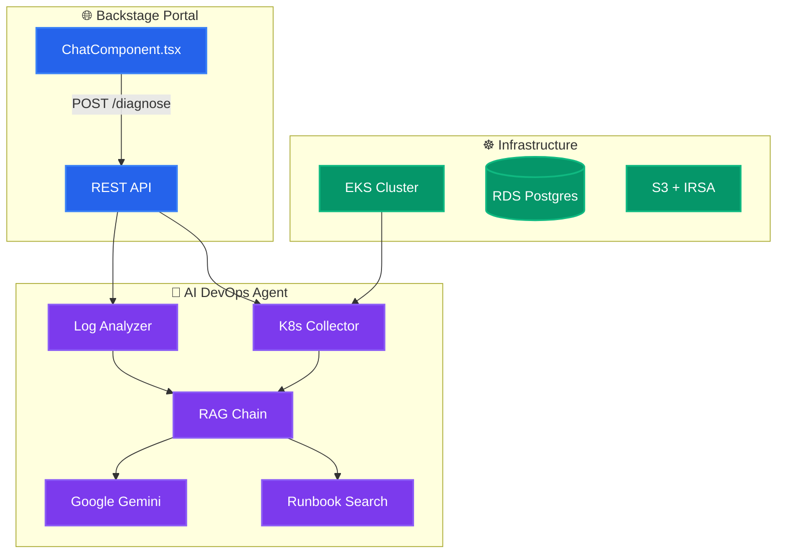

# 🤖 AI-Native Internal Developer Platform (IDP)

> **🛡️ Production-grade IDP with AI-powered DevOps diagnostics, runbook automation, and Kubernetes insights.**

---

## 📋 Overview

When developers face errors (CrashLoopBackOff, OOMKilled, ImagePullBackOff), the AI Agent:

| Step | Action | Description |
|------|--------|-------------|
| 1️⃣ | **Classify** | Regex-based detection of known error patterns |
| 2️⃣ | **Collect** | Fetches live K8s data (pods, events, cluster health) |
| 3️⃣ | **Analyze** | Uses Google Gemini + RAG to diagnose root cause |
| 4️⃣ | **Suggest** | Returns fix commands, prevention tips, and related runbooks |
| 5️⃣ | **Expose** | REST API for Backstage portal and CI/CD integrations |

💡 *No API key? Runs in mock mode with pre-classified suggestions.*

---

## 🏗️ Architecture & Flow



---

## 🛠️ Tech Stack

| Layer | Technology | Purpose |
|-------|------------|---------|
| 🧠 **AI Agent** | Python, FastAPI, LangChain, Google Gemini | Error classification, RAG, structured JSON output |
| 🌐 **Portal** | Backstage, React, TypeScript | Developer UI, scaffolder templates |
| ☸️ **Infrastructure** | AWS EKS, Terraform, RDS, S3 | VPC, cluster, database |
| 📦 **GitOps** | ArgoCD, Kubernetes | Declarative deployment |
| 🔒 **Policy** | OPA Gatekeeper, NetworkPolicy | Cost tags, ingress restrictions |

---

## 🗣️ Languages

| Language | Used In |
|----------|---------|
| **Python** | AI agent, FastAPI, LangChain, K8s collector |
| **TypeScript / React** | Backstage portal, ChatComponent |
| **HCL** | Terraform infrastructure |
| **YAML** | Kubernetes manifests, ArgoCD, GitHub Actions |

---

## 📁 Project Structure

```
ai-devops-idp/
│
├── ai-agent/                          # 🤖 AI Diagnostics Engine (Python/FastAPI)
│   ├── main.py                        #    FastAPI app — /diagnose, /cluster-health, /suggest-runbook, /health
│   ├── rag_chain.py                   #    RAG pipeline — Gemini LLM + runbook retrieval + JSON output
│   ├── config.py                      #    Centralized settings (pydantic-settings)
│   ├── models.py                      #    Pydantic request/response models + enums
│   ├── k8s_collector.py               #    Live Kubernetes data collector (pods, deployments, nodes)
│   ├── log_analyzer.py                #    Regex-based error classifier (OOM, CrashLoop, etc.)
│   ├── runbooks/                      #    📚 Markdown runbooks for common failures
│   │   ├── crashloopbackoff.md        #       CrashLoopBackOff diagnosis & fix steps
│   │   ├── oomkilled.md               #       OOMKilled (exit code 137) guide
│   │   ├── imagepullbackoff.md        #       ImagePullBackOff / registry auth issues
│   │   └── terraform-state-lock.md    #       Terraform DynamoDB lock troubleshooting
│   ├── Dockerfile                     #    Multi-stage build, non-root user, HEALTHCHECK
│   ├── .dockerignore                  #    Excludes dev files from Docker context
│   ├── requirements.txt               #    Pinned Python dependencies
│   ├── pyproject.toml                 #    Ruff, pytest, mypy config
│   └── tests/                         #    Unit tests (log_analyzer, rag_chain, API)
│       ├── conftest.py
│       ├── test_api.py
│       ├── test_log_analyzer.py
│       ├── test_rag_chain.py
│       └── test_runbooks.py
│
├── portal/                            # 🌐 Backstage Developer Portal
│   ├── Dockerfile                     #    Node 18 multi-stage build for Backstage
│   ├── README.md                      #    Build prerequisites, plugin integration
│   ├── plugins/
│   │   └── ai-ops-assistant/
│   │       └── src/components/
│   │           └── ChatComponent.tsx  #    AI chat UI — severity banners, copyable commands
│   └── scaffolder-templates/
│       └── react-ssr-template.yaml    #    Backstage scaffolder template for React SSR apps
│
├── infra/                             # 🏗️ Terraform Infrastructure-as-Code
│   ├── main.tf                        #    VPC, EKS, RDS, S3, IRSA (using TF modules)
│   ├── variables.tf                   #    Parameterized inputs with validation rules
│   ├── backend.tf                     #    S3 remote state + DynamoDB locking
│   ├── outputs.tf                     #    Cluster endpoint, RDS URI, subnet IDs, IRSA ARN
│   └── security.tf                    #    Security groups — RDS from EKS only
│
├── gitops/                            # ☸️ Kubernetes Manifests & GitOps
│   ├── base/
│   │   ├── ai-agent.yaml              #    Deployment (2 replicas) + Service + ServiceAccount
│   │   ├── namespace.yaml             #    Namespace + Secrets
│   │   └── network-policy.yaml        #    Ingress/egress restrictions
│   ├── argocd/
│   │   └── application.yaml           #    ArgoCD Application — auto-sync, self-heal
│   └── policies/
│       └── opa-loadbalancer-tag.yaml  #    OPA Gatekeeper — enforce cost tags on LoadBalancers
│
├── docs/                              # 📚 Documentation
│   ├── API.md                         #    Full API reference
│   └── SECRETS.md                     #    External Secrets, IRSA, secret handling
│
├── .github/
│   ├── workflows/
│   │   └── ci.yml                     #    CI — Ruff, pytest, Bandit, Trivy, tfsec
│   ├── CODEOWNERS
│   ├── dependabot.yml
│   ├── ISSUE_TEMPLATE/
│   │   ├── bug_report.md
│   │   └── feature_request.md
│   └── PULL_REQUEST_TEMPLATE.md
│
├── docker-compose.yml                 # 🐳 Local dev stack (AI Agent + PostgreSQL + ChromaDB)
├── .env.example                       #    Environment variable template
├── .gitignore
├── .pre-commit-config.yaml            #    Ruff, Bandit, Terraform fmt
├── Makefile                           #    lint, test, fmt, tf-validate targets
├── ARCHITECTURE.md
├── CONTRIBUTING.md
├── SECURITY.md
├── LICENSE                            #    MIT License
└── README.md                          #    This file
```

---

## 🚀 Quick Start

```bash
# 1. Configure secrets
cp .env.example .env   # Add GOOGLE_API_KEY

# 2. Run locally with Docker Compose
docker compose up --build -d

# 3. Test the API
curl http://localhost:8000/health
curl -X POST http://localhost:8000/diagnose \
  -H "Content-Type: application/json" \
  -d '{"error_message": "Pod OOMKilled", "namespace": "default"}'
```

📖 **Further reading:** [docs/API.md](docs/API.md) · [docs/SECRETS.md](docs/SECRETS.md) · [ARCHITECTURE.md](ARCHITECTURE.md)

---

## 🐳 Docker — Local Development

### Prerequisites

- [Docker Desktop](https://www.docker.com/products/docker-desktop/) installed and running
- A [Google Gemini API key](https://aistudio.google.com/app/apikey)

### 1. Setup Environment

```bash
git clone https://github.com/SergioSediq/ai-devops-idp.git
cd ai-devops-idp

cp .env.example .env
# Edit .env and add your Gemini API key
```

### 2. Start All Services

```bash
docker compose up --build

# Or run in detached mode
docker compose up --build -d
```

### 3. Verify Services

```bash
docker compose ps

curl http://localhost:8000/health

curl -X POST http://localhost:8000/diagnose \
  -H "Content-Type: application/json" \
  -d '{
    "error_message": "Pod my-app-xyz is in CrashLoopBackOff with exit code 137",
    "namespace": "production",
    "pod_name": "my-app-xyz"
  }'

curl -X POST http://localhost:8000/suggest-runbook \
  -H "Content-Type: application/json" \
  -d '{"error_message": "OOMKilled", "top_k": 3}'
```

### 4. Stop Services

```bash
docker compose down          # Stop containers
docker compose down -v       # Stop + remove volumes
```

### Individual Docker Builds

```bash
docker build -t idp-ai-agent:latest ./ai-agent

docker run -p 8000:8000 \
  -e GOOGLE_API_KEY=your-key \
  -e LOG_LEVEL=DEBUG \
  idp-ai-agent:latest

# Portal (requires Backstage scaffolding first)
docker build -t idp-portal:latest ./portal
```

### Docker Compose Services

| Service | Port | Image | Purpose |
|---------|------|-------|---------|
| `ai-agent` | `8000` | Custom (Python 3.11) | AI diagnostics engine |
| `postgres` | `5432` | `postgres:14-alpine` | Backstage backend database |
| `chromadb` | `8100` | `chromadb/chroma` | Vector store for RAG runbook search |

---

## 🤖 AI Agent — API Reference

### `POST /diagnose` — Full AI Diagnosis

Classifies errors, collects live K8s data, and returns structured fixes.

**Request:**

```json
{
  "error_message": "CrashLoopBackOff: back-off 5m0s restarting failed container",
  "pod_name": "api-server-7d9f8b6c5-xk4jn",
  "namespace": "production",
  "deployment_name": "api-server",
  "include_cluster_health": true
}
```

| Field | Type | Required | Description |
|-------|------|----------|-------------|
| `error_message` | string | Yes | Raw error log or description |
| `pod_name` | string | No | Kubernetes pod to inspect |
| `deployment_name` | string | No | Deployment to inspect |
| `namespace` | string | No | Namespace (default: `default`) |
| `include_cluster_health` | bool | No | Include cluster-wide health data |

**Response:**

```json
{
  "request_id": "a1b2c3d4",
  "timestamp": "2026-02-19T10:30:00.000Z",
  "severity": "HIGH",
  "error_category": "CrashLoopBackOff",
  "root_cause": "Container exits with code 137 (OOMKilled) due to memory limit of 256Mi",
  "explanation": "The container is being killed by the Linux OOM killer because...",
  "fix_commands": [
    {
      "command": "kubectl set resources deployment/api-server -n production --limits=memory=512Mi",
      "description": "Increase memory limit to 512Mi",
      "risk_level": "LOW"
    }
  ],
  "prevention_tips": [
    "Set memory requests to the p95 usage observed in monitoring",
    "Enable Vertical Pod Autoscaler (VPA) in recommendation mode"
  ],
  "related_runbooks": ["oomkilled.md", "crashloopbackoff.md"]
}
```

### `GET /cluster-health` — Cluster Health Summary

```bash
curl http://localhost:8000/cluster-health
```

Returns node status, memory/disk pressure, and overall cluster health.

### `POST /suggest-runbook` — Runbook Search

```json
{
  "error_message": "terraform state lock",
  "top_k": 3
}
```

Returns relevant internal runbooks ranked by keyword relevance.

### `GET /health` — Liveness Probe

```json
{
  "status": "ok",
  "service": "ai-devops-assistant",
  "version": "2.0.0",
  "k8s_connected": true,
  "llm_configured": true
}
```

**Swagger UI:** `http://localhost:8000/docs`

---

## 🏗️ Infrastructure — Terraform

### Prerequisites

- [Terraform ≥ 1.6](https://developer.hashicorp.com/terraform/install)
- AWS CLI configured with appropriate permissions
- S3 bucket + DynamoDB table for remote state

### Remote State Setup (one-time)

```bash
aws s3api create-bucket \
  --bucket idp-platform-terraform-state \
  --region ap-south-1 \
  --create-bucket-configuration LocationConstraint=ap-south-1

aws s3api put-bucket-versioning \
  --bucket idp-platform-terraform-state \
  --versioning-configuration Status=Enabled

aws dynamodb create-table \
  --table-name idp-platform-terraform-locks \
  --attribute-definitions AttributeName=LockID,AttributeType=S \
  --key-schema AttributeName=LockID,KeyType=HASH \
  --billing-mode PAY_PER_REQUEST \
  --region ap-south-1
```

### Deploy Infrastructure

```bash
cd infra

terraform init
terraform plan -var="rds_master_password=YourSecurePassword123!"
terraform apply -var="rds_master_password=YourSecurePassword123!"
```

### Key Resources Created

| Resource | Description |
|----------|-------------|
| **VPC** | Dedicated network with public/private subnets across 2 AZs |
| **EKS Cluster** | Managed Kubernetes with configurable node count |
| **RDS PostgreSQL** | PostgreSQL database for Backstage catalog |
| **S3 Bucket** | Artifact storage with unique suffix |
| **IRSA Role** | IAM Role for AI Agent ServiceAccount → CloudWatch read |
| **Security Groups** | RDS (PostgreSQL from EKS only) |

### Key Terraform Variables

| Variable | Default | Description |
|----------|---------|-------------|
| `project_name` | `idp-platform` | Resource naming prefix |
| `environment` | `development` | `production`, `staging`, `development`, `dev` |
| `aws_region` | `ap-south-1` | AWS region |
| `eks_cluster_version` | `1.28` | EKS Kubernetes version |
| `eks_node_instance_types` | `["t3.medium"]` | Worker node types |
| `rds_instance_class` | `db.t3.small` | RDS instance size |
| `rds_master_password` | — | **Required**, sensitive |

---

## ☸️ GitOps — ArgoCD

### Install ArgoCD

```bash
kubectl create namespace argocd
kubectl apply -n argocd -f https://raw.githubusercontent.com/argoproj/argo-cd/stable/manifests/install.yaml

kubectl -n argocd get secret argocd-initial-admin-secret -o jsonpath="{.data.password}" | base64 -d

kubectl port-forward svc/argocd-server -n argocd 8080:443
```

### Deploy the Application

```bash
# Update gitops/argocd/application.yaml — replace YOUR_ORG with your GitHub org
kubectl apply -f gitops/argocd/application.yaml
```

ArgoCD syncs manifests from `gitops/base/`:

- **AI Agent Deployment** — 2 replicas with health probes
- **ServiceAccount** — IRSA annotation for AWS access
- **NetworkPolicy** — Ingress from portal only
- **Namespace** — `idp-platform`

### OPA Gatekeeper Policy

```bash
kubectl apply -f https://raw.githubusercontent.com/open-policy-agent/gatekeeper/release-3.14/deploy/gatekeeper.yaml
kubectl apply -f gitops/policies/opa-loadbalancer-tag.yaml
```

Blocks any `LoadBalancer` Service without AWS cost-control tags.

---

## 🌐 Portal — Backstage

### Setup Backstage (first time)

```bash
cd portal

npx @backstage/create-app@latest

cd plugins/ai-ops-assistant
npm install

cd ../..
npm run dev
```

### ChatComponent Features

- 🎨 **Severity-colored banners** — CRITICAL (red), HIGH (orange), MEDIUM (yellow), LOW (green)
- 📋 **One-click copy** on fix commands
- ⚠️ **Risk indicators** — LOW/MEDIUM/HIGH per command
- 🛡️ **Prevention tips** section
- 📚 **Runbook links** — clickable badges
- ⏳ **Loading animation** with error handling

---

## 🔄 CI/CD Pipeline

| Job | Trigger | What it does |
|-----|---------|--------------|
| 🔍 **Lint & Test** | Push + PR | Ruff, Bandit, pip-audit, mypy, pytest (coverage ≥20%) |
| 🐳 **Build & Push** | Push to `main` | Docker → Amazon ECR |
| 🏗️ **Terraform** | Push + PR | fmt + validate + tfsec |
| ☸️ **K8s** | Push + PR | kubeconform validation |
| 🔒 **Trivy** | Push to `main` | Fails on CRITICAL/HIGH CVEs |

### Required GitHub Secrets

| Secret | Description |
|--------|-------------|
| `AWS_ROLE_ARN` | IAM Role ARN for GitHub Actions OIDC |

---

## ⚙️ Environment Variables

### AI Agent

| Variable | Required | Default | Description |
|----------|----------|---------|-------------|
| `GOOGLE_API_KEY` | **Yes** | — | Google Gemini API key |
| `GEMINI_MODEL` | No | `gemini-2.0-flash` | Gemini model name |
| `RATE_LIMIT_REQUESTS` | No | `60` | Max requests per minute |
| `LOG_LEVEL` | No | `INFO` | DEBUG/INFO/WARNING/ERROR |
| `APP_HOST` | No | `0.0.0.0` | FastAPI bind host |
| `APP_PORT` | No | `8000` | FastAPI bind port |
| `CORS_ORIGINS` | No | `*` | Comma-separated allowed origins |
| `LLM_TEMPERATURE` | No | `0.0` | LLM response temperature |
| `LLM_MAX_OUTPUT_TOKENS` | No | `4096` | Max tokens in response |
| `RUNBOOK_DIR` | No | `runbooks` | Path to runbook markdown files |

### PostgreSQL (docker-compose)

| Variable | Default | Description |
|----------|---------|-------------|
| `POSTGRES_PASSWORD` | `backstage_dev_pass` | Database password |

### AWS / Terraform

| Variable | Description |
|----------|-------------|
| `AWS_REGION` | AWS region (default: `ap-south-1`) |
| `AWS_ACCESS_KEY_ID` | AWS access key (or use IAM roles) |
| `AWS_SECRET_ACCESS_KEY` | AWS secret key (or use IAM roles) |

---

## 🔒 Security

| Layer | Implementation |
|-------|----------------|
| **Container** | Non-root user (`appuser`), multi-stage Docker build |
| **Network** | K8s NetworkPolicy — AI agent reachable from portal only |
| **IAM** | IRSA — scoped AWS permissions via ServiceAccount |
| **Database** | Security group — PostgreSQL from EKS nodes only |
| **Secrets** | K8s Secrets; use [External Secrets](docs/SECRETS.md) in production |
| **Policy** | OPA Gatekeeper — blocks untagged LoadBalancers |
| **CI/CD** | Trivy, Bandit, pip-audit on every build |
| **State** | Terraform state encrypted in S3 with DynamoDB locking |

---

## 📚 Runbooks

Pre-built runbooks in `ai-agent/runbooks/`:

| Runbook | Covers |
|---------|--------|
| `crashloopbackoff.md` | App crashes, bad probes, missing deps, exit codes |
| `oomkilled.md` | Exit code 137, memory limits, JVM heap, VPA |
| `imagepullbackoff.md` | Registry auth, rate limits, ECR permissions |
| `terraform-state-lock.md` | Stale locks, force-unlock, CI/CD timeouts |

The AI agent searches these during diagnosis and references them in responses.

---

## 🛠️ Development

```bash
# Run AI Agent locally (without Docker)
cd ai-agent
pip install -r requirements.txt
export GOOGLE_API_KEY="your-key"
python main.py                        # http://localhost:8000

# Run tests (mock mode: no API key)
export GOOGLE_API_KEY=""
pytest tests/ -v

# Lint & format
ruff check .
ruff format .

# Terraform validate
cd infra
terraform init -backend=false
terraform validate
terraform fmt -check -recursive
```

---

## 👤 Author

**Sergio Sediq**

- 🔗 [GitHub](https://github.com/SergioSediq)
- 💼 [LinkedIn](https://www.linkedin.com/in/sedyagho/)
- ✉️ sediqsergio@gmail.com

---

## 📝 License

This project is licensed under the **MIT License**. See the [LICENSE](LICENSE) file for details.
