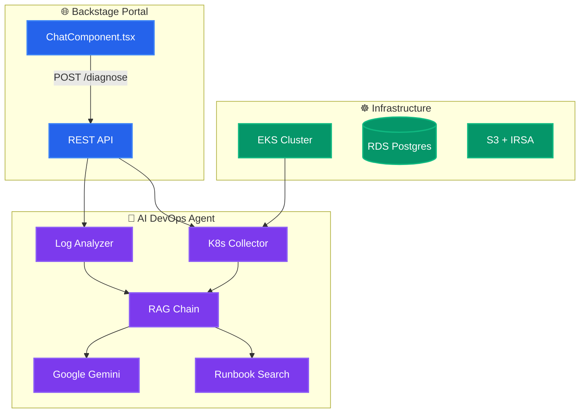

# 🤖 AI-Native Internal Developer Platform (IDP)

> **🛡️ Production-grade IDP with AI-powered DevOps diagnostics, runbook automation, and Kubernetes insights.**

---

## 📋 Overview

When developers face errors (CrashLoopBackOff, OOMKilled, ImagePullBackOff), the AI Agent:

| Step | Action | Description |
|------|--------|-------------|
| 1️⃣ | **Classify** | Regex-based detection of known error patterns |
| 2️⃣ | **Collect** | Fetches live K8s data (pods, events, cluster health) |
| 3️⃣ | **Analyze** | Uses Google Gemini + RAG to diagnose root cause |
| 4️⃣ | **Suggest** | Returns fix commands, prevention tips, and related runbooks |
| 5️⃣ | **Expose** | REST API for Backstage portal and CI/CD integrations |

💡 *No API key? Runs in mock mode with pre-classified suggestions.*

---

## 🏗️ Architecture & Flow



---

## 🛠️ Tech Stack

| Layer | Technology | Purpose |
|-------|------------|---------|
| 🧠 **AI Agent** | Python, FastAPI, LangChain, Google Gemini | Error classification, RAG, structured JSON output |
| 🌐 **Portal** | Backstage, React, TypeScript | Developer UI, scaffolder templates |
| ☸️ **Infrastructure** | AWS EKS, Terraform, RDS, S3 | VPC, cluster, database |
| 📦 **GitOps** | ArgoCD, Kubernetes | Declarative deployment |
| 🔒 **Policy** | OPA Gatekeeper, NetworkPolicy | Cost tags, ingress restrictions |

---

## 🗣️ Languages

| Language | Used In |
|----------|---------|
| **Python** | AI agent, FastAPI, LangChain, K8s collector |
| **TypeScript / React** | Backstage portal, ChatComponent |
| **HCL** | Terraform infrastructure |
| **YAML** | Kubernetes manifests, ArgoCD, GitHub Actions |

---

## 📁 Project Structure

```
├── ai-agent/           🤖 AI diagnostics engine (FastAPI + Gemini + RAG)
├── portal/             🌐 Backstage plugin + scaffolder templates
├── infra/              ☸️ Terraform (VPC, EKS, RDS, S3, IRSA)
├── gitops/             ☸️ K8s manifests, ArgoCD, OPA policies
├── docs/               📚 API reference, secrets guide
└── .github/workflows/  ⚙️ CI (Ruff, pytest, Bandit, Trivy)
```

---

## 🚀 Quick Start

```bash
# 1. Configure secrets
cp .env.example .env   # Add GOOGLE_API_KEY

# 2. Run locally with Docker Compose
docker compose up --build -d

# 3. Test the API
curl http://localhost:8000/health
curl -X POST http://localhost:8000/diagnose \
  -H "Content-Type: application/json" \
  -d '{"error_message": "Pod OOMKilled", "namespace": "default"}'
```

📖 **Further reading:** [docs/API.md](docs/API.md) · [docs/SECRETS.md](docs/SECRETS.md) · [ARCHITECTURE.md](ARCHITECTURE.md)

---

## 🐳 Docker Services

| Service | Port | Purpose |
|---------|------|---------|
| `ai-agent` | `8000` | AI diagnostics engine |
| `postgres` | `5432` | Backstage backend DB |
| `chromadb` | `8100` | Vector store for runbook search |

---

## 🔄 CI/CD Pipeline

| Job | Trigger | What it does |
|-----|---------|--------------|
| 🔍 **Lint & Test** | Push + PR | Ruff, Bandit, pip-audit, mypy, pytest (coverage ≥20%) |
| 🐳 **Build & Push** | Push to `main` | Docker → Amazon ECR |
| 🏗️ **Terraform** | Push + PR | fmt + validate + tfsec |
| ☸️ **K8s** | Push + PR | kubeconform validation |
| 🔒 **Trivy** | Push to `main` | Fails on CRITICAL/HIGH CVEs |

---

## 📚 API Endpoints

| Endpoint | Method | Description |
|----------|--------|--------------|
| `/diagnose` | POST | Full AI diagnosis (classify + K8s + RAG) |
| `/suggest-runbook` | POST | Search runbooks by error keywords |
| `/cluster-health` | GET | Cluster-wide node/pod health |
| `/health` | GET | Liveness/readiness probe |

**Swagger UI:** `http://localhost:8000/docs`

---

## ⚙️ Environment Variables

| Variable | Required | Default | Description |
|----------|----------|---------|-------------|
| `GOOGLE_API_KEY` | **Yes** | — | Google Gemini API key |
| `GEMINI_MODEL` | No | `gemini-2.0-flash` | Gemini model |
| `RATE_LIMIT_REQUESTS` | No | `60` | Requests per minute |
| `LOG_LEVEL` | No | `INFO` | DEBUG / INFO / WARNING / ERROR |

---

## 🔒 Security

| Layer | Implementation |
|-------|----------------|
| **Container** | Non-root user, multi-stage Docker |
| **Network** | K8s NetworkPolicy (portal → agent only) |
| **IAM** | IRSA for scoped AWS access |
| **Secrets** | K8s Secrets; use [External Secrets](docs/SECRETS.md) in prod |
| **CI/CD** | Trivy, Bandit, pip-audit |

---

## 📚 Runbooks

Pre-built runbooks in `ai-agent/runbooks/`:

| Runbook | Covers |
|---------|--------|
| `crashloopbackoff.md` | App crashes, probes, exit codes |
| `oomkilled.md` | Exit 137, memory limits, VPA |
| `imagepullbackoff.md` | Registry auth, ECR permissions |
| `terraform-state-lock.md` | DynamoDB lock, force-unlock |

---

## 👤 Author

**Sergio Sediq**

- 🔗 [GitHub](https://github.com/SergioSediq)
- 💼 [LinkedIn](https://www.linkedin.com/in/sedyagho/)
- ✉️ sediqsergio@gmail.com

---

## 📝 License

MIT
